# Appium

## 一、app测试基础理论

### 1、app的应用架构

* app属于CS架构，是通过HTTP协义来传输数据的。 通过json的格式来传送数据的。

### 2、app项目环境及发布平台

#### 2.1 app项目环境介绍(后端服务器环境)

* 开发环境         是给开发人员进行代码联调的。给开发进行自测的。
* 测试环境         用来给测试人员进行测试用的。测试环境也可能分为手工测试环境和自动化测试环境的。
* 预发布环境    当项目要上线时，做最后一轮的验收测试时，预发布环境的数据跟生产环境的数据是一致的。
* 镜像环境        当生产环境出现问题时，把生产环镜的相关数据以及代码全部拉到镜像环境，复现生产上的问题，然后由测试人员协助开发人员复现问题，然后由开发人员去进行问题的定位和分析。
* 生产环境       给用户或者是客户使用的环境 (生产环境测试人员不能随便操作，由运维人员管理的)


#### 2.2 灰度发布介绍

所谓灰度发布，就是指在发布生产环境过程当，先发布其中几台服务器，如果这几台服务器功能运行一段时间后能够正常，那么再把其他未升级或者未发布的服务器进行生产环境发布，那如果说先发布的几台服务器运行有问题，那么就需要回滚到原来的版本。


#### 2.3app项目发布平台

* android   安卓app文件后缀名是  apk

* IOS    苹果app文件后缀名是ipa

* 获取app安装包文件的方式一:

  * anroid  可以直接找开发给对应apk安装包
  * IOS  直接将手机给开发人员，让开发人员安装对应的ipa包

* 获取app安装包文件的方式二:

  * 可以借助内测试平台

    国内用的内测平台是蒲公英， 国外用的是fir.im   

  * 测试包生成之后会上传到蒲公英平台，然后生成一个链接地址（二维码），可以直接通过二维码或者链接地址下载对应的测试包

* 生产app安装包的获取

  anroid app安装包    豌豆荚、应用宝、360手机助手、各类手机品牌商城(上传app安装包需要审核 2-3 )

  ios   app安装包    appstore  itools（IOS时间更长，一周左右）

  

### 3、敏捷开发模型

#### 3.1 敏捷开发模型介绍

* 瀑布模型（传统行业）

  * 需求分析
  * 设计
  * 编码
  * 测试
  * 运行维护

   优点：

  1、为项目提供了按阶段划分检查点(文档)

  2、当前一阶段完成后，只需要关注后续阶段。

  缺点：

  1、在项目各介段之间极少有反馈，出现问题没法及时处理，灵活性差

  2、只有在项目结束交付上线时才能看到最终的结果

  3、需要太多的文档来驱动项目进行。影响项目的效率。

  结论：采用传统的瀑布模型最大的问题是开发的周期长，迭代的速度慢。

互联网行业特点：追求创新、以快吃慢、需求高度不确定性

互联网产品开发的特点：新需求、新方向

降低项目风险，确保正确的方向：快速的反馈机制、快速试错的流程 （针对需求不确定性）

敏捷开发：

概念：以用户的需求为核 心，采用迭代、循序渐近的方法进行软件开发

在敏捷开发过程当，软件项目在构建初期会被切分成不同的子系统以及不同的失代，各个子项目的成果经过测度，具备可视，可集成和可运行的特征。

#### 3.2 Scrum介绍

概念：Scrum是一个敏捷开发框架，是一个增量的，迭代的开发过程。在这个框架中，整个开发周期包括若干个小的迭代
周期，每个小的迭代周期成为一个Sprint（sprint：项目开发过程中最小迭代周期），每个Sprint的周期建议为2~4
周。在Scrum中，将产品Backlog（产品待办列表）按商业价值排出需求列表。在每个迭代中开发团队从产品
Backlog挑选最有价值的需求进行开发，实现完成后产品推出市场，进入下一个迭代

需要熟悉的三个角色:

* 产品负责人：收集产品需求，确定产品上线时间，排产品需求的优先级
* 项目经理：带领团实现SCRUM敏捷过程，确保组内成员不被外界干扰，确保组内成员按时完成任务
* 开发团队：程序员，测试员，设计（程序员分前端、后端、android开发、ios开发）
* 每日立会: 需要知道每天干 了什么，明天计划干什么，以及遇到的问题。   一般早上开会，15分钟左右。 同时需要知道项目的进度是否正常


### 4、app应用测试流程

* 参与需求评审         评审前一定要看需求文档
* 制定测试计划       一般由测试负责人或测试主管制定
* 设计编写测试用例    有一些小公司由人力时间紧张，可以不写用例，需要写测试点。用例评审
* 执行用例，跟踪缺陷      搭建环境，冒烟测试（有可能做，也有可能不做）
* 编写提交版本测试报告   


## 二、手工测试要点


### 1、app测试要点

* 功能测试   
* 兼容性测试
* 安装、卸载、升级测试
* 交叉事件测试
* PUSH测试
* 性能测试
  * CPU
  * 内存
  * 流畅度
  * 流量
  * 电量
  * 启动速度
* 用户体验测试
* 稳定性测试
* 弱网测试

### 2、功能测试

根据测试功能去拆分功能点，再根据功能点去分析测试点。

### 3、兼容性测试（专项）

* 系统 

  - 1、android   2、IOS

* 手机系统的版本    覆盖主流    https://tongji.baidu.com/research/app 

  * android  对应的主流版本 9.0 \ 8.1  \10.0的版本
  * IOS     对应的主流版本  13.3.1 \ 13.4.1\ 13.3 

* 品牌-机型       覆盖主流     https://tongji.baidu.com/research/app 

  * android   华为、小米、vivo
  * IOS 苹果

* 屏幕分辨率   覆盖主流    https://tongji.baidu.com/research/app 

* 软硬件兼容性
  
  与手机硬件兼容
  home键、电源键、音量调节等
  与外部硬件设备兼容
  耳机、蓝牙等
  与操作系统软件兼容
  wlan设置、系统时间调节、LBS定位等
  与其他APP兼容
  后台在播放音乐时，进入动态页面点击动态视频的播放，系统如何处理
  
* 网络兼容性   

  2G\3G\4G\5G\WIFI

  

  不可能去做全兼容的测试。

  可以去做深度兼容测试。需要借助于第三方云测试平台。testin云测，云测平台有很多手机。

  在云测平台注册账号，上传APP，给钱，拿 报告 。
  
  

### 4、安装卸载升级测试（专项）

app是一个客户端程序，客户端在使用前是需要安装的，因此需要测试安装、卸载、升级的操作

安装测试点：（只要大家能想到的点，都可以去进行测试，没有对错）

* 正常场景：

1、在不同的操作系统、不同的手机品版和版本上安装

2、从不同的渠道下载app进行测试

3、不同的安装路径，安装在手机的内存卡或者是SD卡（非必要）

异常场景：

4、安装时出现异常（关机、断网），恢复后能否继续安装

5、安装时存储空间不够或者内存不足

6、安装时点出取消再安装

7、安装之后再次覆盖安装

8、低版本覆盖安装高版本

* 卸载

  正常卸载：长按app正常删除卸载、通过第三方工具进行卸载

  异常卸载：app正在运行卸载、取消卸载、卸载关机、卸载之后数据是否保留

* 升级

  正常升级: 从低版本升级到高版本，从app内部升级， 从app应用商城升级

  异常升级：跨版本升级， 关机，内存不足，电量不足

  升级提示

  升级之后数据的检查

  


### 5、交叉测试

概念：交叉测试又称为冲突测试，或者干 扰测试

交叉事件的关注点：

1、app运行时接打电话

2、app运行时收发短信

3、app运行时收到推送通知

4、app运行时接到视频通话

5、app运行连接蓝牙

6、app运行时切换网络、切换应用

7、app运行时旋转屏幕


### 6、push消息测试

* 消息推送的场景:
  * 新闻资讯类通知， 让用户实时获取到自己感兴趣的新闻，从而增加用户的粘性
  * 商城类通知，  让用户获取到商城的促销活动，提高用户的成交率
  * 流程类的通知， 让用户及时获取处理工作的内容。
* 推送原理：  是由服务器通过推送的服务将对应的消息推送到app端。 是一个长连接的状态。
* 推送服务器： 使用的是第三方的推送服务器。（极光或者信鸽）
* 手机厂商会自己的推送服务器。
* 中小企业不会自己搭建推送服务器，一般使用的都是第三方的推送服务器
* push消息推送的关注点
  * PUSH消息推送是否按指业务规则发送.
  * 当PUSH推送时，检查是否按特定用户去进行推送.
  * 设置不接收推送消息时，确认是否正常
  * 推送通知的跳转是否正常
  * 推送消息的打开及展示
  * 包括app是否运行，都需要去关注推送消息能否收到。


### 7、性能测试

1、打开USB调式，   点击“系统应用”--“设置”， 在设置 的最下方选择“关于平板电脑”，在关于平板电脑中点击“版本号”，直接提示开发者选项已打开。

2、返回到设置 菜单页面时，可以  看到 “开发者选项”这个菜单。点击进入到开发者选项， 需要打开  USB调试  以及指针位置  这两个选项。

3、开启超级管理员访问权限

* 点击“系统应用”--“文件管理器”， 在文件管理器的左上方有三横杆的按钮，在弹出的页面中点击左下方的 齿轮 按钮，进入到设置页面之后，选择  “常规设置”---“访问模式”，将访问模式更改为超级管理员访问模式。

  

#### 7.1 性能工具介绍及安装

GT随身调   android版是由腾讯公司开发的性能测试平台。直接运行在手机上面的。

可以通过GT工具进行基础的性能测试：内存、CPU、电量、网络流量、流畅度，可以以绘制图表的形式显示出指标的相关数据

GT工具提供了查看日志的功能。可以通过查看相关日志来分析和定位app功能异常以及crash等问题

#### 7.2 性能工具使用

* 打开GT工具，在AUT界面选择被测试的app以及对应的性能指标

* 设置参数，进入到参数页面，点击右上角的"编辑"按钮，拖动想要测试的参数到已关注区域，而且要勾选。

  勾选之后，点击上方的红色 录制按钮。

* 执行测试之前，进入到日志界面，开启logcat的日志记录功能。

* 如果要进行电量或流量的性能测试需要进入到插件页面进行设置。

* 返回到AUT界面，在上面点击“启动”或者“running” 来启动被测试的app

* 针对app进行相关的业务操作

* 操作完成之后，再进入到GT工具，查看性能参数的数据。

#### 7.3 CPU测试

GT工具提供了两个CPU的监控指标：CPU和jiffes

CPU指标就是指当前手机中cpu的整体使用率

用户态：cpu处于应用程序执行的时间

系统态：表示的是系统内核执行的时间

空闲态：表示空闲系统进程执行的时间

cpu使用率 = cpu空闲态/cpu的总的执行时间

jiffies： 表示的是开机以来，程序消耗的CPU时间片的总数

CPU问题的影响:

1、CPU使用长时间处于90%以上  (70   80 )

2、手机发热、耗电量增加

3、反应变慢，引起ANR(假死状态)

操作步骤：

1、打开GT工具，进入到AUT页面，选择测试的app，勾选CPU性能指标

2、进入到参数界面，配置CPU参数选项，然后进行勾先，点击录制

3、进入到日志界面，打开logcat记录日志

4、返回到AUT界面，启动app

5、针对app进行相关的业务操作（实际工作当中，操作时间会比较长）

6、返回到GT工具界面，查看相关的参数数据。

#### 7.4 内存测试

PSS和private dirty

private dirty（私有内存）:

进程独占的内存，也就是进程销毁时可以回收的内存容量.

PSS(实际使用内存):

将跨进程的共享内存也加入进来，进行按比列计算PSS。就能够准确的表示进程占用的实际物理内存。

常见问题：

1、内存泄漏

内存泄漏（memory leak）：当程序运行时申请了对应的内存空间，而当程序销毁时并没有释放对应的内存空间。

2、内存溢出

内存溢出 (out of memory):是指程序在申请内存空间时，没有足够的内存空间供其使用。

* 内存问题产生的影响

  1、程序实际使用的内存PSS会不停的增长

  2、程序会出现闪退（crash）

内存的指标根据不同的手机配置、以及不同的公司，指标值是不一样的。

* 内存操作步骤：
  * 打开GT工具，选择对应的被测app， 勾选内存指标（PSS和private dirty）
  * 进入到参数界面，编辑参数，勾选对应参数，并点击录制按钮
  * 进入到日志界面，开启logcat,记录日志信息
  * 回到AUT界面，点击 启动按钮，启动被测试的app
  * 针对启动的app进行相关的业务功能操作（时间一般也会在几个小时左右。）
  * 操作完成，回到GT工具的参数界面，查看获取到的参数数据。

#### 7.5 流畅度测试

GT工具提供了流畅度的监控指标：FPS

FPS是指人的肉眼能够看到的画面每一秒帧数

效果：想要达到流畅的效果，至少每秒的帧数要达到24帧

每秒和帧数越高流畅度就越好

如果想要达到最佳的流畅度需要达到每秒60帧

当页面静止不动时，FPS的值显示的是0

测试时间：15-30分钟

操作步骤：

1、打开GT工具，进入到AUT界面，选择被测试的app

2、进入到参数界面，点击编辑拖动FPS参数到已关注参数中，勾选之后，点击录制

3、进入到日志界面，开启logcat记录日志信息

4、返回到AUT界面，点击启动，打开被测试的app

5、针对被测app进行相关的业务操作

6、返回到参数界面查看参数数据

#### 7.6 流量测试

GT工具里面提供了一个监控流量的指标：NET

流量：手机在访问网络过程当所产生的上传和下载的数据（报文）就称为流量

* 常用流量测试方法

  * 抓包测试法

    通过抓包工具将所有的网络应用数据包，全部抓取到并保存到某个文件中，进行分析的过程 。

    wireshark所有协议的报文，sniffer也可以抓所有的报文，tcpdump命令可以抓所有的报文

  * 统计测试法

    获取的是某一个应用程序获取的数据报文，统计出对应的流量。

* GT工具测试步骤:

  * 打开GT进入到AUT界面，选择被测试的app，勾选NET指标
  * 进入到参数界面，点击编辑，拖选 NET参数，勾选并点击录制
  * 进入到日志界面，开启Logcat记录日志信息
  * 进入到插件界面，选择“抓包”，再点击“开始”
  * 返回到AUT界面，点击“启动”，启动测试app
  * 针对启动的app进行相关业务操作
  * 返回到参数界面，停止录制，再返回到插件界面，点击“抓包”，再点“停止”

流量的优化：

* 数据压缩                             

  ​	在HTTP协议中可以通过此字段将数据进行压缩，减少数据容量。content-encoding: gzip

* 不同的数据格式的采用      

  ​	json   lxml     数据格式

* 控制访问的频次                

  ​	通过异步加载的方式来加载数据。

* 只获取必要的数据    

* 缓存机制   

* 懒加载    

  ​	将多个图片放在同一张图片里面，一起加载。

#### 7.7 电量测试

GT工具当中提供了电量的监控指标：电流、电压，电量跟温度

就是指移动设备电量消耗快慢的一种测试方法。一般用平均电流来衡量电量的消耗速度。

常见的耗电场景：

定位，GPS

网络传输

蓝牙

屏幕的亮度

GT工具只能特定类型的机型进行电量的测试。

可换其他性能测试工具进测试，也可以使用对比方式进行测试（拿 同类型的产品，在同样的手同样的场景下进行对比测试。）

#### 7.8 启动速度测试

启动速度介绍：
app的启动分为冷启动， 热启动。
冷启动：
指app被后台杀死后， 在这个状态打开app， 这种启动方式叫做冷启动。
热启动：
指app没有被后台杀死， 仍然在后台运行， 通常我们再次去打开这个app， 这种启动方式叫热启动。

测试方法：
使用命令adb shell am start -W -n 包名/Activity名， 查看 App 启动耗时。

Starting: Intent { act=android.intent.action.MAIN cat=[android.intent.category.LAUNCHER] cmp=com.baidu.homework/.activity.user.passport.ChoiceLoginModeActivity }
Status: ok
Activity: com.baidu.homework/.activity.user.passport.ChoiceLoginModeActivity
ThisTime: 3345
TotalTime: 3345
WaitTime: 3378

该命令获取3个关键指标：
ThisTime： 表示一连串启动Activity的最后一个Activity启动耗时， 一般会<=TotalTime时间。
TotalTime： 应用的启动时间， 包括创建进程、 App初始化、 Activity初始化到界面显示。 （开发者需要优化的耗时）需要大家关注的是TotalTImie的时间值，那么在实际的测试过程当，会进行多次测试，然后取平均值。
WaitTime： 前一个应用activity pause的时间+TotalTime（具体的使用在第五章第二节第六小节）

启动速度的测试结果分析：
同电量测试一样， 我们可以测试出APP冷启动和热启动时花费的时长， 但是是否有问题需要对比分析， 对比方法：
（1） 与基准数据对比。 （基准数据来自于产品经理， 或者以往数据积累）
（2） 横向对比， 拉上竞品一起测（目前多数采用这种方法）
同样的网络、 手机， 相似的测试场景， 最后对比我们的产品和竞品在启动时长方面的差距， 给出优化建议。 

 

### 8、用户体验测试

用户体验主要是跟app的界面有关。

* UI界面测试    包括界面的设计、界面元素框架、结构、颜色、布局、图片、按钮选中的一些效、文字的内容。
* 易用性测试    菜单的层次、完成业务操作的步骤是否过多， 点击按钮的范围 是不是合适，包括返回键的操作
* 横竖屏测试    横屏之后，页在的表格是不是能正常的显示。
* 关注手机上的其他辅助功能    放大字体

### 9 、稳定性测试（8小时）

通过长时间对应用程序进行无序操作， 检验应用程序是否会出现异常。 如闪退crash、 无响应ANR等。

稳定性测试工具——Monkey
Monkey是一个命令行工具， 是由安卓官方提供的。
测试人员可以通过Monkey来模拟用户的触摸、 点击、 滑动以及系统按键等操作（操作事件都是随机的） ， 从而实现对APP压力的测试和稳定性测试。 （具体Monkey的使用在第五章第三节）
开发人员结合monkey 打印的日志和系统打印的日志， 修改测试中出现的问题。


* monkey   集成在adb工具当中,主要用来做稳定性测试用的, monkey是通过java语言编写的一种稳定性测试工具。

  主要用来测试app会不会出现crash（崩溃）的情况。

  相当于让一只猴子来随机操作app，所有的操作都有可能出现，长时间的操作来测试app会不会出现问题。

* monkey常用的参数

  * -p 参数   对指定的app进行随机操作

  adb shell monkey -p com.baidu.homework  100    (100次随机事件)

  * -v 参数   表示的是记录信息的级别

    level 0：adb shell monkey -p com.baidu.homework  -v 100   默认级别

    level 1:  adb shell monkey -p com.baidu.homework  -v  -v 100 打印出来的信息会比较详细,只打印跟本程序相关的日志信息

    level 2:  adb shell monkey -p com.baidu.homework  -v  -v -v 100  打印出来的信息会更多，会显示出其他程序运行的信息

  * -s   用于指定伪随机数。如果两次的伪随机数相同，那么两次的操作步骤、流程、操作事件完全一样。

    主要的作用，就是用来复现上次的问题

    adb shell monkey -p com.baidu.homework  -v  -v  -s 10  100

  * --throttle 用于指定随机事件的间隔时间, 单位是毫秒

    adb shell monkey -p com.baidu.homework  -v  -v  --throttle 3000 -s 10  100

  组合使用:

  adb shell monkey -p com.baidu.homework  --throttle 500 --pct--touch 10  --pct-motion 50  -v -v -s 100 300> log.log

  --pct--touch   10       触模(10表示的是整个随机同件中的百分比)

  --pct-motion  50      滑屏(50表示的是整个随机同件中的百分比)

* 日志分析

  如果在日志里面出现了 ANR（application not responsing）

  如果日志中出现了Exception，可能程序崩溃。

  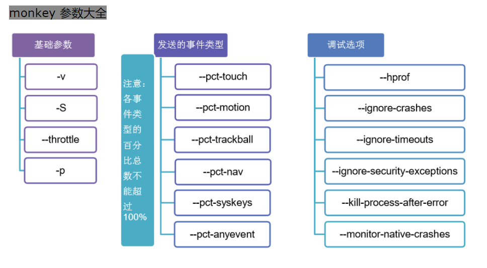


稳定性测试的时机
一般需要等产品稳定了， bug比较少的时候， 再用monkey去测试待测试应用的稳定  

### 10、弱网测试

* 弱网测试步骤:

  * 打开fiddler，设置相应的代理端口（当端口被占用时需要手动更改代理端口）

  * 在fiddler中设置网络的上传和下载的速度

    * 点击 “rules”--“customize rules”

  * 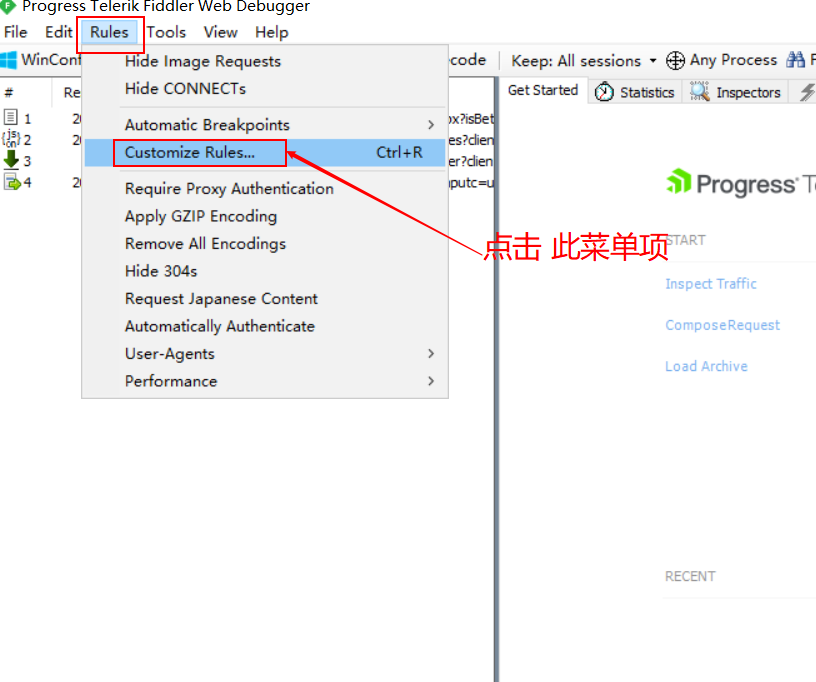

    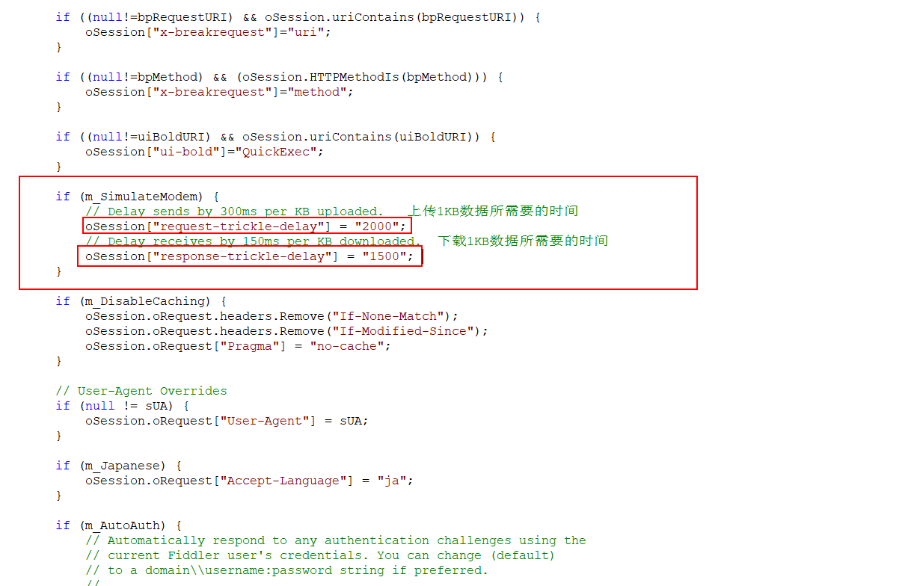

    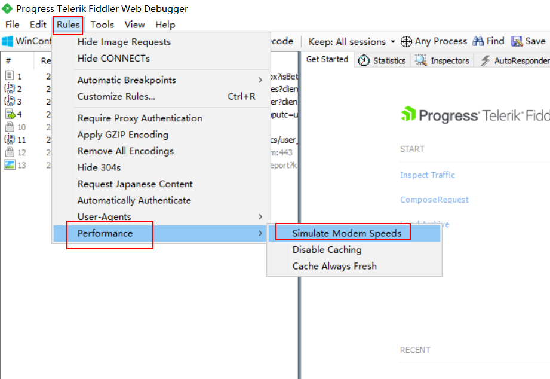

  * 在手机中设置网络的代理

    * 手机的IP地址必须与fiddler电脑的IP地址，是同一个局域 网。也就是在同一网段。

      查看电脑的IP地址命令： ipconfig


### 11、后续

当对app进行了充分的测试之后，就可以编写测试报告 ，发布app到线上了。

app的发布，打包上传到各大应用商城。

测试人员也需要关注，关注的是app线上的BUG。

运维需要关注的app的线上环境


## 三、app自动化框架介绍

### 1、常用自动化框架介绍

* Robtium  

  基于anroid的一款开源自动化测试框 架

  支持java语言

  不支持跨平台

* macaca

  由阿里巴巴公开开发的一套开源自动化解决方案

  适用平台：PC端、android、IOS

  支持的语言：java、python、nodejs

* Appium

  是一款国外开源的自动化测试框架

  适用平台：android、IOS

  支持的语言:java\js\php\python\C#\ruby

  社区活跃、资料丰富

* appium的特点:

  * 开源

  * 支持Native App(全部android sdk的java代码生成)  原生的app如果页面有变更，就得发一版本，提交到应用商城去审核 

    Web App（都是由HTML5生成的）  访问速度慢。H5的代码以及元素信息

    Hybird APP（既有native app也有H5的页面）混合app  是当前工作中用得最多的

  * 支持andorid  、IOS

  * 支持跨平台、支持windows、linux、macos

  * 支持多语言  java  js  python C#   ruby

### 2、appium介绍

#### 2.1 appium设计理念

C/S架构， appium的核心是一个web服务器， 提供了一套接口。 他会接收客户端发送过来的命
令， 然后在移动设备上运行命令， 最后把运行结果通过HTTP响应包返回给客户端。

session， 每个client连接到server以后都会创建一个session， 自动化始终围绕一个session进
行  

#### 2.2 appium自动化原理

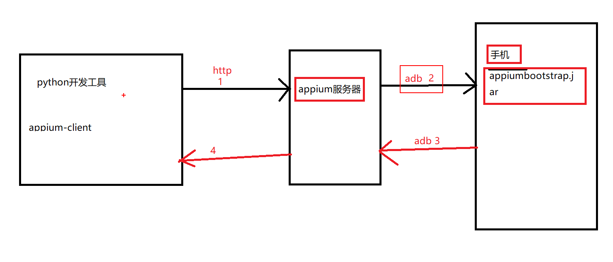

通过此图可以知道app的自动化环境需要以下工具：

* appium服务器
* 基于python的appium客户端(appium-client-python)
* adb(adb集成在android-sdk中)
* JDK

## 四、自动化测试环境搭建

### 1、java安装

双击可执行文件，安装过程中建议不要将安装目录设置在含有中文的目录。建议不要发装在系统盘中。

验证： 在DOS命令行中输入 java   -version 如果能看下图所显示的信息就是正确的。

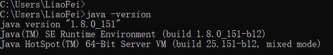


### 2、android SDK安装

#### 2.1 androidSDK安装

下载链接： https://android-sdk.en.softonic.com/?ex=MOB-593.7 

* 安装步骤：

  * 解压android-sdk的压缩包文件
  * 将解压的目录复制到某一个文件夹下，文件夹的路径也不要包含 中文
  * 添加相应的环境变量（以下三个目录）
    * D:\Program Files\android-sdk\tools        uiautomatorviewer.bat工具可以用来查看app的元素信息
    * D:\Program Files\android-sdk\platform-tools     adb.exe  此工具用来连接手机
    * D:\Program Files\android-sdk\build-tools\25.0.0     aapt.exe 可以获取app的包名和启动名

* 验证:

  1、在DOS命令行中输入 uiautomatorviewer  如果能显示以下图片，就说明是正常的。

  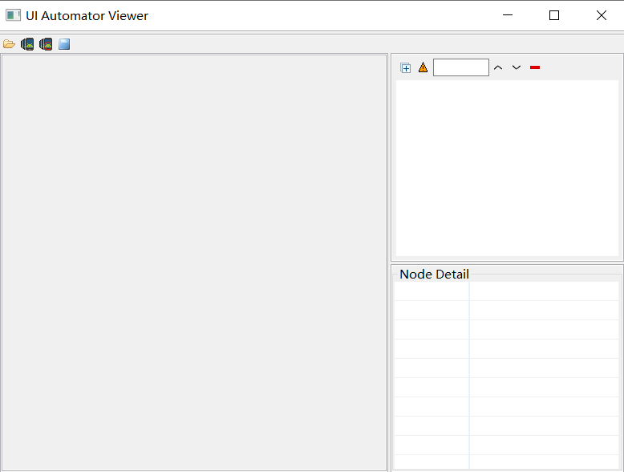

  2、在DOS命令行中输入： adb  ，如果 能出现以下图片，就说明是正常.

  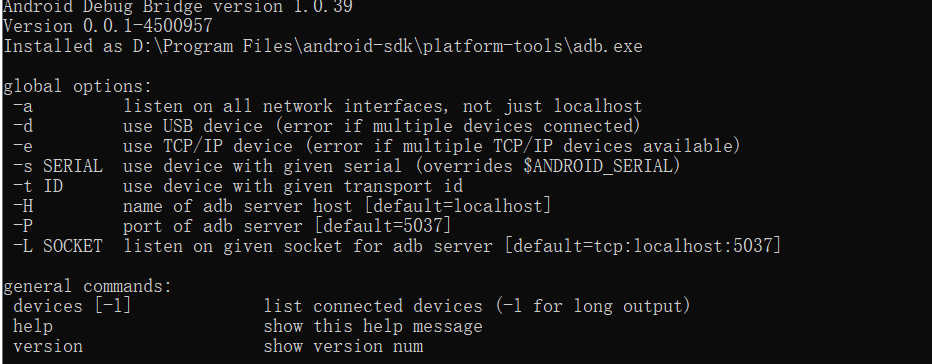

  3、在DOS命令行中输入:  aapt , 如果能出现发下图片，就说明是正常的

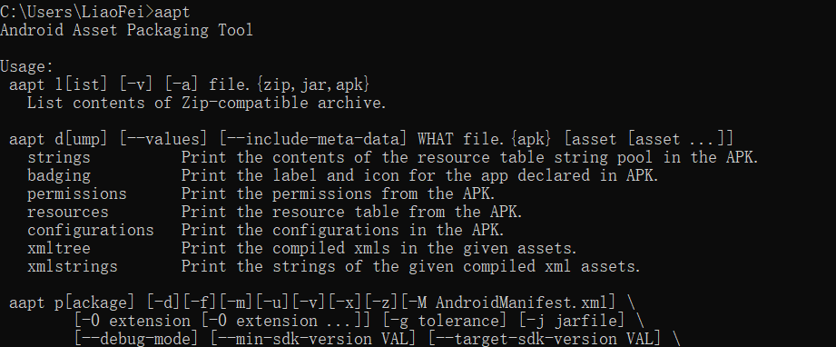

### 3、模拟器安装（略过）


### 4、appium服务器安装

#### 4.1 appium安装

* 双击appium服务器的可执行文件，默认安装在C盘。

#### 4.2 appium验证

* 启动服务之前，需要先配置jdk以及android-sdk的目录。

  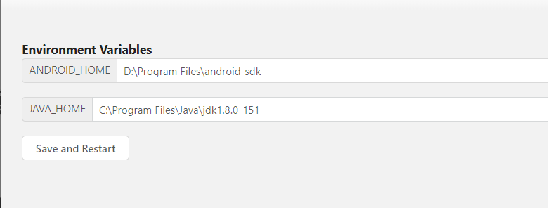

* 启动服务,如果能看到以下图片信息，说明安装正常

  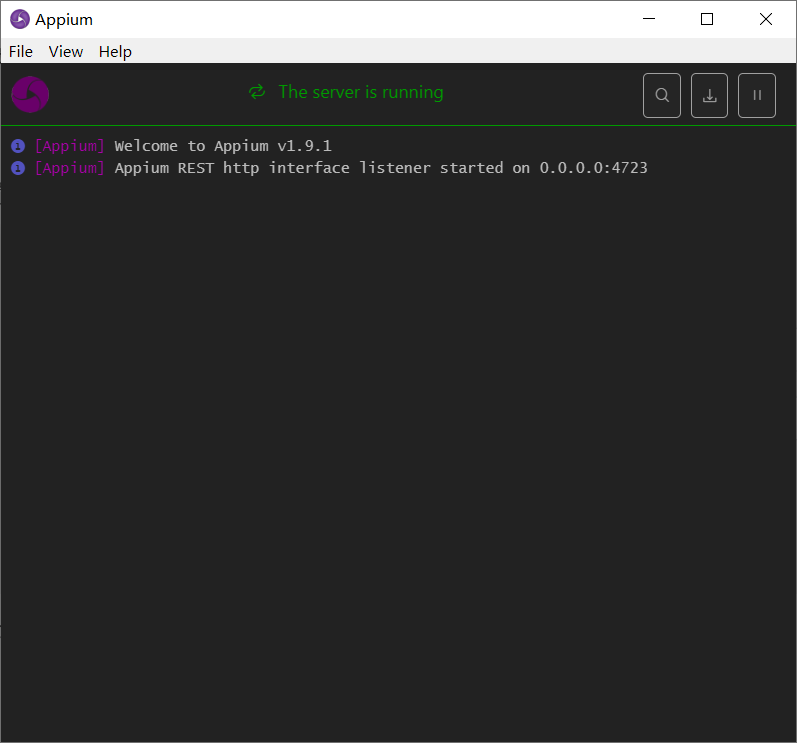

  

### 5、appium-client-python安装

* 安装方式
  * 离线      解压对应的安装包文件，进到解压目录下执行 python setup.py install
  * 在线      pip install Appium-Python-Client
  * pycharm   
* 验证是否安装
  * pip show Appium-Python-Client
  * pycharm


## 五、adb工具

### 1、adb工具构成及原理

* adb  包含 了三个部分
  * adb 客户端    用来下发adb的指令工具
  * Server 服务端   adb.exe执行之后的进程，表示adb的服务端，通过服务端与手机上的adb守护进程进行 通信
  * adb守护进程   随着android系统的启动而启动，当android系统关闭之后它才会关闭。

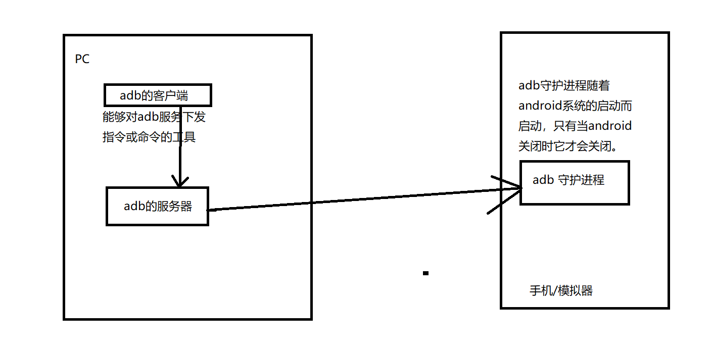

### 2、adb常用命令

#### 2.1 adb常用命令(常看设备、启动关闭adb服务)

如果是真机，不要 使用一带多接头的数据线,否则找不到手机设备

* adb devices       常看手机的设备ID名称以及状态  

  emulator-5554   device         emulator-5554表示的是手机设备的ID名称， device表示设备处于在线状态，

  如果不在线显示的是offline        如果adb服务没有启动，下发该命令时，会自动的去启动adb的服务

* adb start-server   启动adb服务    

* adb kill-server   关闭adb 服务

#### 2.2 获取包名和界面名

* 包名: app包名  ,通过app的包名来区分不同的app，app包名是唯一的
* 界面名(启动名): 相当于web页面当中的链接地址，在app当中，每个界面都有一个名字

原因：自动化过程当，需要通过app的包名和界面名来启动app。

* 操作步骤:  adb命令

  * 在手机或者模拟器上面打开app

  * windows命令一：adb shell dumpsys window windows | findstr  mFocusedApp

  * windows命令二:   adb shell dumpsys window |findstr "usedApp"

    com.android.settings/.Settings       com.android.settings是包名，    .Settings是界面名  通过 /  分隔包名和界面名

    LINUX/MacOS命令一:  adb shell dumpsys window windows | grep mFocusedApp

    LINUX/MacOS命令二:   adb shell dumpsys window |grep  "usedApp"

* 通过aapt获取app的包名和界面名

  * aapt dump badging  D:\BaiduNetdiskDownload\apptools\apk\xuechebu.apk  后面表示的是app安装包的路径及名称

    包名：  package: name='com.bjcsxq.chat.carfriend'    # package:name  后面的字符串表示的是app的包名

    界面名:  launchable-activity: name='com.bjcsxq.chat.carfriend.module_main.activity.SplashActivity'    launchable-activity: name后面的字符串是界面

#### 2.3 安装卸载app

* app安装    adb install 路径/app安装包名称

* app卸载    adb uninstall 包名

  

#### 2.4 上传下载文件

* 上传  将电脑上的文件上传到手机

  adb push  电脑上的文件路径    手机的路径

  例子：adb push ./monkey.txt  /sdcard

* 下载文件   从手机上下载文件到本地

  adb pull  手机的文件路径     电脑的文件夹路径

  例子：adb pull /sdcard/monkey.txt  D:\opt


#### 2.5 查看日志信息

为什么要获取日志信息：用来给开发定位问题。

adb  logcat    来查看相关的日志信息


### 3、adb 操作命令

* 手势操作命令

  * 模拟点击事件

    adb shell input tap x y           #  x y表示的是坐标点    参数之间用空格隔开

  * 模拟滑屏事件（参数之间用空格隔开）

    adb shell input swipe   startx starty  endx  endy    # startx, starty 表示的是起始点坐标，endx，endy表示的是终点坐标

  * 模拟键盘操作

    adb shell input keyevent  键值   (3   表示的HOME键    4 表示的返回键    66表示的回车键)

  * 模拟输入操作

    adb shell input text  内容    内容表示要输入的内容，另外输入的内容不能是中文

    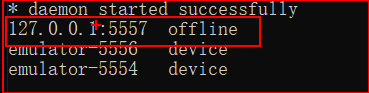

    <font color=red>如果出现上图中  offline的设备，记得重启一下adb服务</font>

  * <font color=red>如果电脑上面连接了多个模拟器或者是手机。那么需要加上一个参数  -s  device_name  </font>

    adb -s emulator-5554 shell  input keyevent 4


## 六、基础初始化示例

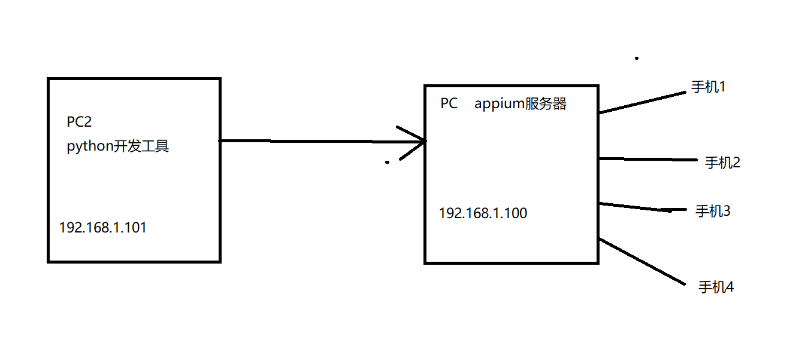

```
# 导入webdriver
import time

from appium import webdriver
# 初始化app的配置信息
des_cap = dict()  # 定义字典参数

des_cap["platformName"] = "android"   # 表示的是android 或者IOS系统
des_cap["platformVersion"] = "5.1.1"  # 表示的是平台系统的版本号
des_cap["deviceName"] = "****"  # 表示的是设备的ID名称（如果只有一个设备可以用****来替代）
des_cap["appPackage"] = "com.android.settings"  # 表示的是app的包名
des_cap["appActivity"] = ".Settings"  # 表示的是app的界面名

driver = webdriver.Remote("http://localhost:4723/wd/hub", des_cap)

time.sleep(6)

driver.quit()
```


---

## 七、uiautometorview工具使用

* 通过uiautomatorviewer工具可以查看app的元素信息。

  查看元素信息：

  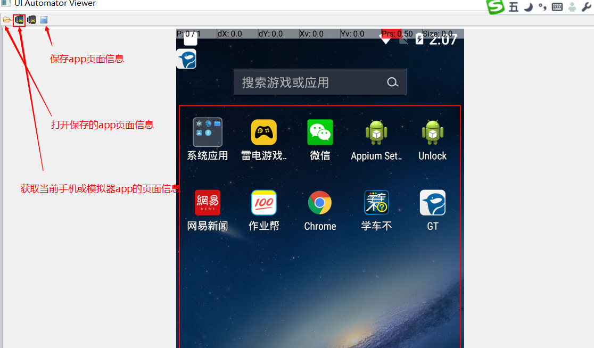

* 如果出现如下错误：

  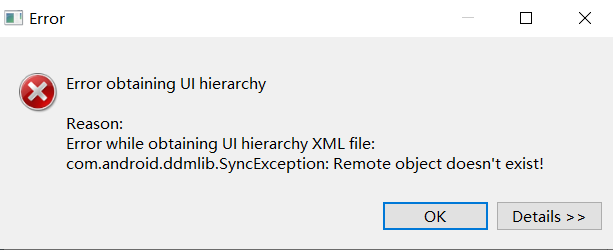

需要重启adb服务。获取app页面信息时不能正在运行代码，会占用adb服务。


为了提高效率，在android sdk的  tools目录下，将uiautomatorviewer.bat复制一份出来，并修改为ui.bat就OK了。

后续直接在dos中输入ui就可以打开了

## 八、appium基础操作

### 1、通过appium启动app

* driver.start_activity("包名"，”界面名“)

  ```
  driver.start_activity("com.baidu.homework", ".activity.user.passport.ChoiceLoginModeActivity")
  
  ```

### 2、获取包名和界面名

​	driver.current_package  获取当前脚本运行中的app的包名

​	driver.current_activity    获取当前脚本运行中的app的界面名


### 3、关闭app及关才驱动

* 关闭app   driver.close_app()    不需要跟参数
* 关闭驱动  driver.quit()

区别:

关闭app之后，可以再使用其他代码启动新的app

关闭驱动，那么代码与appium服务器之间的连接已经断，开不能再做任何的操作。

 

### 4、安装卸载app以及判断是否安装app

* 安装app    driver.install _app(apk路径)
* 卸载app    driver.remove_app(app包名)

```python
# 导入webdriver
import time

from appium import webdriver
# 初始化app的配置信息
des_cap = dict()  # 定义字典参数

des_cap["platformName"] = "android"   # 表示的是android 或者IOS系统
des_cap["platformVersion"] = "5.1.1"  # 表示的是平台系统的版本号
des_cap["deviceName"] = "****"  # 表示的是设备的ID名称（如果只有一个设备可以用****来替代）
des_cap["appPackage"] = "com.android.settings"  # 表示的是app的包名
des_cap["appActivity"] = ".Settings"  # 表示的是app的界面名

driver = webdriver.Remote("http://localhost:4723/wd/hub", des_cap)
driver.close_app()
time.sleep(2)
# 安装263app
# driver.install_app(r"D:\BaiduNetdiskDownload\apptools\apk\263.apk")

# 卸载263app
driver.remove_app("com.em.mobile")
time.sleep(6)
driver.quit()

```

* 判断手机是否安装app   driver.is_app_installed("包名")

  返回值：True  有安装app 或者False  没有安装app

### 5、将应用置于后台运行

driver.background_app(seconds)  # seconds 表示的是将app置于后台运行多少秒的时间然后返回前台


## 九、元素定位

### 1、定位单个元素

#### 1.1 通过ID定位元素

​      通过元素的resource-id来进行元素定位

​	driver.find_element_by_id(resource_id的值)


#### 1.2 通过class_name定位元素

​	通过元素的class属性值来进行元素定位

​	app中，class的值始终都只有一个。

​	driver.find_element_by_class_name(class)


#### 1.3 通过xpath定位元素

​    通过xpath的元素属性来进行元素定位

  driver.find_element_by_xpath("//*[@text='value']")

单个元素定位不到会报错。

```python
# 导入webdriver
import time

from appium import webdriver
# 初始化app的配置信息
from selenium.webdriver.common.by import By

des_cap = dict()  # 定义字典参数

des_cap["platformName"] = "android"   # 表示的是android 或者IOS系统
des_cap["platformVersion"] = "5.1.1"  # 表示的是平台系统的版本号
des_cap["deviceName"] = "****"  # 表示的是设备的ID名称（如果只有一个设备可以用****来替代）
des_cap["appPackage"] = "com.android.settings"  # 表示的是app的包名
des_cap["appActivity"] = ".Settings"  # 表示的是app的界面名

driver = webdriver.Remote("http://localhost:4723/wd/hub", des_cap)
# 找到“更多”按钮并点击(XPATH)
element = driver.find_element(By.XPATH, "//*[@text='更多']")
element.click()
time.sleep(2)
# 找到 飞行模式的 开关，并点击(ID)
air_element = driver.find_element(By.ID, "android:id/switchWidget")
air_element.click()
time.sleep(2)
# 找到返回按钮并点击(class)
return_element = driver.find_element(By.CLASS_NAME, "android.widget.ImageButton")
return_element.click()
time.sleep(3)
driver.quit()

```


通过显示等待定位元素

```python
from selenium.webdriver.support.wait import WebDriverWait
# 定义一个获取元素的方法


# def get_element(driver, find_type, value):
#     wait = WebDriverWait(driver, 10, 1)
#     element = wait.until(lambda x: x.find_element(find_type, value))
#     return element

def get_element(driver, element):
    wait = WebDriverWait(driver, 10, 1)
    element = wait.until(lambda x: x.find_element(element[0], element[1]))
    return element
```


### 2、定位一组元素

   driver.find_elements_by_id(resource_id)

​	driver.find_elements_by_class_name(class_name)

​	driver.find_elements_by_xpath(xpath)     

​	driver.find_elements(By.ID,  value)

返回的值是一个列表，如果没有找到，说明列表是空值，可以通过下标来使用其中的元素对象，下标是从0开始。

## 十、元素操作

###  1、点击操作

 	element.click()    针对元素进行点击操作

### 2、清空和输入操作

​	element.clear()   针对元素进行清空操作

​	element.send_keys("value")    针对元素进行输入操作

### 3、输入的封装

```python
#  为了保证代码的健壮性，确定输入的内容一定不会出错，所以在输入前做了一次清除。
def input_text(element, text):
    """
    :param element:  表示的是元素对象
    :param text: 表示的是要输入的内容
    :return:
    """
    # 清除元素中的文本内容
    element.clear()
    # 输入文本内容
    element.send_keys(text)
```

### 4、获取元素的信息

* 获取元素的文本内容(获取的是元素text属性的内容)

  element.text

* 获取元素的位置

  element.location  返回的值是一个字典，字典中包含x和y ， x和y表示的是元素在手机屏幕左上角的点的坐标

* 获取取元素的大小

  element.size     返回值是一个字典，字典中会包含 width和height， width表示的宽度，height表示的高度

* 获取元素的属性值

  element.get_attribute("attribute")  # attribute表示的是属性名称

  获取ID值时，  attribute=  “resourceId”  

  获取的是class的值 ,   attribute="className"

  如果attribute = "name"时，获取的是text或者content-desc（text优先，找不到text值，再去找content-desc的值）

```python
# 导入webdriver
import time

from appium import webdriver
# 初始化app的配置信息
from selenium.webdriver.common.by import By

from utils import get_element

des_cap = dict()  # 定义字典参数

des_cap["platformName"] = "android"   # 表示的是android 或者IOS系统
des_cap["platformVersion"] = "5.1.1"  # 表示的是平台系统的版本号
des_cap["deviceName"] = "****"  # 表示的是设备的ID名称（如果只有一个设备可以用****来替代）
des_cap["appPackage"] = "com.android.settings"  # 表示的是app的包名
des_cap["appActivity"] = ".Settings"  # 表示的是app的界面名

driver = webdriver.Remote("http://localhost:4723/wd/hub", des_cap)
# 找到wlan 元素
wlan_btn = By.ID, "com.android.settings:id/title"
element = get_element(driver, wlan_btn)
# 获取wlan菜单的文本内容
print(element.text)

# 获取wlan的位置信息
print(element.location)

# 获取wlan元素的大小
print(element.size)

# 获取wlan元素
print(element.get_attribute("className"))

time.sleep(6)

driver.quit()
```

## 十一、进阶初始化示例

### 1、输入中文的处理

在初始化配置中增加两个参数:

```python
"resetKeyboard": True,        # 重置设备的输入键盘
"unicodeKeyboard": True        # 采用unicode编码输入
```

```python
from selenium.webdriver.support.wait import WebDriverWait
# 定义一个获取元素的方法


# def get_element(driver, find_type, value):
#     wait = WebDriverWait(driver, 10, 1)
#     element = wait.until(lambda x: x.find_element(find_type, value))
#     return element
# 减少代码量，不必要在每个元素定位的代码中都使用显示等待来定位。
def get_element(driver, element):   # element 表示的元素定位的值
    wait = WebDriverWait(driver, 10, 1)
    element = wait.until(lambda x: x.find_element(element[0], element[1]))
    return element


# 判断元素是否存
def element_is_exsit(driver, element):   # element 表示的元素定位的值
    try:  # 捕获异常信息
        get_element(driver, element)    # 能够正常找元素，就返回True
        return True
    except Exception as e:   # 如果捕获到了异常，返回False
        return False


#  为了保证代码的健壮性，确定输入的内容一定不会出错，所以在输入前做了一次清除。
def input_text(element, text):
    """
    :param element:  表示的是元素对象
    :param text: 表示的是要输入的内容
    :return:
    """
    # 清除元素中的文本内容
    element.clear()
    # 输入文本内容
    element.send_keys(text)
```


### 2、区分首次打开还是非首次打开

```python
"noReset": True  # 用来记住app的session，如果有登陆或做过初始化的操作，为True时，后面不需要再操作
```

```python
# 导入webdriver
import time
from appium import webdriver
# 初始化app的配置信息
from selenium.webdriver.common.by import By

from utils import get_element, input_text, element_is_exsit

des_cap = {
"platformName" : "android" ,   #表示的是android  或者ios
"platformVersion" : "5.1.1",   #表示的是平台系统的版本号
"deviceName" : "****",    #表示的是设备的ID名称（如果只有一个设备可以用****来代替）
"appPackage" : "com.bjcsxq.chat.carfriend",   #表示app的包名
"appActivity" :  ".module_main.activity.SplashActivity",      #表示的是app的界面名
"noReset": True  # 用来记住app的session，如果有登陆或做过初始化的操作，为True时，后面不需要再操作
####"".module_main.activity.MainActivity""
}  #定义字典参数

driver = webdriver.Remote("http://localhost:4723/wd/hub",des_cap)

agree_btn = By.XPATH, "//*[@text='同意并继续使用APP']"

# 通过同意协议来判断app是否是首次打开
if element_is_exsit(driver, agree_btn):
    get_element(driver, agree_btn).click()
else:
    print("非首次打开")

# 点击“我的”
me_element = By.ID,"com.bjcsxq.chat.carfriend:id/mine_layout"
get_element(driver, me_element).click()
# 登录
login_element = By.ID, "com.bjcsxq.chat.carfriend:id/mine_username_tv"
get_element(driver, login_element).click()
# 输入手机号
tel_element = By.ID, "com.bjcsxq.chat.carfriend:id/login_phone_et"
input_text(get_element(driver, tel_element), "13751113926")
# 输入密码
password_element = By.ID, "com.bjcsxq.chat.carfriend:id/login_pwd_et"
input_text(get_element(driver, password_element), "a123456b")
# 点击登录
insert_element = By.ID, "com.bjcsxq.chat.carfriend:id/login_btn"
get_element(driver, insert_element).click()
# 点击确定
accept_element = By.CLASS_NAME, "android.widget.Button"
get_element(driver, accept_element).click()
# 点击“驾照圈”
licence_btn = By.ID, "com.bjcsxq.chat.carfriend:id/apply_layout"
get_element(driver, licence_btn).click()
# 选择第一条评论
pl_element = By.ID, "com.bjcsxq.chat.carfriend:id/tv_post_replay"
get_element(driver, pl_element).click()
# 填写评论内容
nr_element = By.XPATH, "//*[@text='发布评论']"
input_text(get_element(driver, nr_element), "test")
# 进行发布
fb_element = By.CLASS_NAME, "android.widget.TextView"
get_element(driver, fb_element)
time.sleep(3)
driver.quit()

```


## 十二、获取手机操作

### 1、获取手机分辨率

 保证脚本在不同机型上都能实现滑屏的操作。 

driver.get_window_size()     返回的值是字典类型， 包含 height 和 width  高度和宽度的值

### 2、获取手机截图

driver.get_screenshot_as_file(filename)    

注意事项：1、路径必须手动创建  2、文件名称必须是以PNG结尾

```python
import time

from appium import webdriver
from selenium.webdriver.common.by import By

from utils import get_element, input_text

des_cap = {
"platformName" : "android" ,   #表示的是android  或者ios
"platformVersion" : "5.1.1",   #表示的是平台系统的版本号
"deviceName" : "****",    #表示的是设备的ID名称（如果只有一个设备可以用****来代替）
"appPackage" : "com.android.settings",   #表示app的包名
"appActivity" :  ".Settings",      #表示的是app的界面名
"resetKeyboard": True,        # 重置设备的输入键盘
"unicodeKeyboard": True        # 采用unicode编码输入
####"".module_main.activity.MainActivity""
}  #定义字典参数

driver = webdriver.Remote("http://localhost:4723/wd/hub",des_cap)

# 获取手机屏幕分辨率
print(driver.get_window_size())

# 截图
driver.get_screenshot_as_file("img/error.png")

time.sleep(2)
driver.quit()
```


### 3、获取设置手机网络

主要是为了实现视频类的app中，视频播放过程中网络切换时会有提示信息的操作。

#### 3.1 获取手机网络

driver.network_connection   

appium定义的网络类型

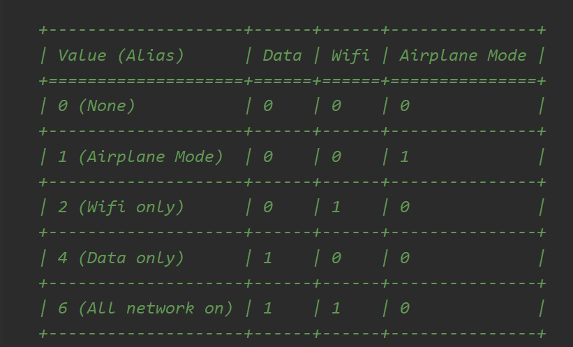

#### 3.2 设置手机网络

driver.set_network_connection(connectionType)   #  connectionType   网络类型的值

```python
import time

from appium import webdriver
from selenium.webdriver.common.by import By

from utils import get_element, input_text

des_cap = {
"platformName" : "android" ,   #表示的是android  或者ios
"platformVersion" : "5.1.1",   #表示的是平台系统的版本号
"deviceName" : "****",    #表示的是设备的ID名称（如果只有一个设备可以用****来代替）
"appPackage" : "com.android.settings",   #表示app的包名
"appActivity" :  ".Settings",      #表示的是app的界面名
"resetKeyboard": True,        # 重置设备的输入键盘
"unicodeKeyboard": True        # 采用unicode编码输入
####"".module_main.activity.MainActivity""
}  #定义字典参数

driver = webdriver.Remote("http://localhost:4723/wd/hub",des_cap)

# 获取网络类型
print(driver.network_connection)

# 设置网络类型
driver.set_network_connection(4)

print(driver.network_connection)
time.sleep(2)
driver.quit()
```


### 4、模拟键盘操作

常用的三个键值： 3 HOME键， 4 返回键 ,  66 回车键

driver.press_keycode(键值)

### 5、手机通知栏操作

driver.open_notifications()

```python
import time

from appium import webdriver
from selenium.webdriver.common.by import By

from utils import get_element, input_text

des_cap = {
"platformName" : "android" ,   #表示的是android  或者ios
"platformVersion" : "5.1.1",   #表示的是平台系统的版本号
"deviceName" : "****",    #表示的是设备的ID名称（如果只有一个设备可以用****来代替）
"appPackage" : "com.android.settings",   #表示app的包名
"appActivity" :  ".Settings",      #表示的是app的界面名
"resetKeyboard": True,        # 重置设备的输入键盘
"unicodeKeyboard": True        # 采用unicode编码输入
####"".module_main.activity.MainActivity""
}  #定义字典参数

driver = webdriver.Remote("http://localhost:4723/wd/hub",des_cap)

#  打开通知栏
driver.open_notifications()

# 模拟返回键
driver.press_keycode(4)

time.sleep(2)
driver.quit()

```


## 十三、滑动和拖拽事件

### 1、swipe滑动事件

 driver.swipe(startx, starty,  endx, endy, duration=None) 

duration用来降低滑屏的速度及惯性, 单位是ms

### 2、swipe滑动事件封装

```python
# 封装滑屏操作方法
def execute_swipe(driver, fx, count=1):
    w = driver.get_window_size()["width"]  # 获取手机屏幕的宽度
    h = driver.get_window_size()["height"] # 获取手机屏幕的高度
    # w=1080  h=1920
    if fx == "top":  # 往上滑
        zb = (w/2, h*0.9, w/2, h*0.1)
    elif fx == "down":  # 往下滑
        zb = (w/2, h*0.1, w/2, h*0.9)
    elif fx == 'left':  # 往左滑
        zb = (w*0.9, h/2, w*0.1, h/2)
    else:  # 往右滑
        zb = (w*0.1, h/2, w*0.9, h/2)
    for i in range(count):
        driver.swipe(*zb, duration=1200)
        time.sleep(1)
```


### 3、swipe边滑动边查找封装

针对频道类的元素进行滑动选择对应的频道。

```python
# 封装一个边滑动边查找的方法
def swipe_find(driver, element, element_info):
    ele_size = element.size  # 获取元素大小
    width = ele_size["width"]  # 获取元素的宽度
    height = ele_size["height"]  # 获取元素的高度
    # 获了element元素左上角点的坐标
    ele_position = element.location
    x = ele_position["x"]  # 获取左上角点的x坐标值
    y = ele_position["y"]  # 获取左上角点的y坐标值

    start_x = x + width*0.9  # 获取的是起始点X的值
    y = y + height*0.5  # 获取的是起始及终止点的Y的值
    end_x = x + width*0.1   # 获取的是终止点X的值
    while True:
        page = driver.page_source  # 记录查找前的页面资源,通过对比页面资源来退出死循环
        try:
            driver.find_element(*element_info).click()  # 如果有找到对应的元素那么点击并返回
            return True
        except Exception as e:
            print("没有找到该元素！")
        driver.swipe(start_x, y, end_x, y, duration=1000)  # 没有找到元素，那么滑屏后再对比并重新查找
        time.sleep(1)
        if page == driver.page_source:
            print("滑屏操作完成且没有找到元素信息")
            return False
```


### 4、scroll滑动事件

scroll是通过元素来进行滑动的

driver.scroll(source_element,  target_element)

scroll无法设置滑动的持续时间，带有一定惯性。 主要用于IOS中，android高版本系统可以使用。

```python
import time

from appium import webdriver
from selenium.webdriver.common.by import By

from utils import get_element, input_text, execute_swipe

des_cap = {
"platformName" : "android" ,   #表示的是android  或者ios
"platformVersion" : "5.1.1",   #表示的是平台系统的版本号
"deviceName" : "****",    #表示的是设备的ID名称（如果只有一个设备可以用****来代替）
"appPackage" : "com.android.settings",   #表示app的包名
"appActivity" :  ".Settings",      #表示的是app的界面名
"resetKeyboard": True,        # 重置设备的输入键盘
"unicodeKeyboard": True        # 采用unicode编码输入
####"".module_main.activity.MainActivity""
}  #定义字典参数

driver = webdriver.Remote("http://localhost:4723/wd/hub", des_cap)
# 存储 按钮
save_btn = By.XPATH, "//*[@text='存储']"
save_element = get_element(driver, save_btn)

# 蓝牙 按钮
lanya_btn = By.XPATH, "//*[@text='蓝牙']"
lanya_element = get_element(driver, lanya_btn)

# 通过scroll来进行滑动操作
driver.scroll(save_element, lanya_element)

time.sleep(3)

driver.quit()
```


### 5、drag_and_drop拖拽事件

从一个元素滑动到另外一个元素的位置， 同时也能实现将一个元素拖动另一个元素当。

driver.drag_and_drop(source_element,  target_element)

source_element 表示的是被拖动的元素对象

target_element 表示的是目标元素对象

```python
import time

from appium import webdriver
from selenium.webdriver.common.by import By

from utils import get_element, input_text

des_cap = {
"platformName" : "android" ,   #表示的是android  或者ios
"platformVersion" : "5.1.1",   #表示的是平台系统的版本号
"deviceName" : "****",    #表示的是设备的ID名称（如果只有一个设备可以用****来代替）
"appPackage" : "com.android.settings",   #表示app的包名
"appActivity" :  ".Settings",      #表示的是app的界面名
"resetKeyboard": True,        # 重置设备的输入键盘
"unicodeKeyboard": True        # 采用unicode编码输入
####"".module_main.activity.MainActivity""
}  #定义字典参数

driver = webdriver.Remote("http://localhost:4723/wd/hub", des_cap)
# 存储
save_btn = By.XPATH, "//*[@text='存储']"
# 更多
more_btn = By.XPATH, "//*[@text='更多']"

# 通过拖动来实现滑屏操作
driver.drag_and_drop(get_element(driver, save_btn),  get_element(driver, more_btn))

time.sleep(3)

driver.quit()
```


## 十四、高级手势操作

实现步骤：

1、创建TouchAction对象

2、调用手势方法

3、调用perform() 执行操作

### 1、轻敲操作

实现步骤：

* action = TouchAction(driver)  #  创建建手势对象

* action.tap(element=None, x=None, y=None， count=1)  # 调用轻敲手势方法，传入的是一个元素对象或者是一个坐标点

  count表示的是轻敲的次数， 默认值为1.

* action.perform() # 调用perform()执行轻敲操作

```python
import time

from appium import webdriver
from appium.webdriver.common.touch_action import TouchAction
from selenium.webdriver.common.by import By

from utils import get_element, input_text

des_cap = {
"platformName" : "android" ,   #表示的是android  或者ios
"platformVersion" : "5.1.1",   #表示的是平台系统的版本号
"deviceName" : "****",    #表示的是设备的ID名称（如果只有一个设备可以用****来代替）
"appPackage" : "com.android.settings",   #表示app的包名
"appActivity" :  ".Settings",      #表示的是app的界面名
"resetKeyboard": True,        # 重置设备的输入键盘
"unicodeKeyboard": True        # 采用unicode编码输入
####"".module_main.activity.MainActivity""
}  #定义字典参数

driver = webdriver.Remote("http://localhost:4723/wd/hub", des_cap)

wlan_btn = By.XPATH, "//*[@text='WLAN']"
wlan_element = get_element(driver, wlan_btn)

# 调用轻敲手势操作
TouchAction(driver).tap(x=457, y=487).perform()
# action = TouchAction(driver)  # 创建手势对象
# # 调用手势方法
# action.tap(wlan_element)
# # 调用perform()执行
# action.perform()
time.sleep(3)
driver.quit()
```


### 2、按下和抬起操作

  按下：

   press(element, x, y)

   抬起：

​	release()

TouchAction(driver).press(x=477, y=489).release().perform()

按下和抬起可以结合起来使用，达到点击的效果

```python
import time

from appium import webdriver
from appium.webdriver.common.touch_action import TouchAction
from selenium.webdriver.common.by import By

from utils import get_element, input_text

des_cap = {
"platformName" : "android" ,   #表示的是android  或者ios
"platformVersion" : "5.1.1",   #表示的是平台系统的版本号
"deviceName" : "****",    #表示的是设备的ID名称（如果只有一个设备可以用****来代替）
"appPackage" : "com.android.settings",   #表示app的包名
"appActivity" :  ".Settings",      #表示的是app的界面名
"resetKeyboard": True,        # 重置设备的输入键盘
"unicodeKeyboard": True        # 采用unicode编码输入
####"".module_main.activity.MainActivity""
}  #定义字典参数

driver = webdriver.Remote("http://localhost:4723/wd/hub", des_cap)

# 调用按钮手势操作
TouchAction(driver).press(x=477, y=489).perform()
# 等待2S
time.sleep(2)
TouchAction(driver).press(x=477, y=489).release().perform()

time.sleep(3)
driver.quit()
```


### 3、按住等待操作

模拟手指等待。 wait(ms=0)   ms表示的是毫秒数

 TouchAction(driver).press(x=650, y=650).wait(5000).release().perform()


```python
import time

from appium import webdriver
from appium.webdriver.common.touch_action import TouchAction
from selenium.webdriver.common.by import By

from utils import get_element, input_text

des_cap = {
"platformName" : "android" ,   #表示的是android  或者ios
"platformVersion" : "5.1.1",   #表示的是平台系统的版本号
"deviceName" : "****",    #表示的是设备的ID名称（如果只有一个设备可以用****来代替）
"appPackage" : "com.android.settings",   #表示app的包名
"appActivity" :  ".Settings",      #表示的是app的界面名
"resetKeyboard": True,        # 重置设备的输入键盘
"unicodeKeyboard": True        # 采用unicode编码输入
####"".module_main.activity.MainActivity""
}  #定义字典参数

driver = webdriver.Remote("http://localhost:4723/wd/hub", des_cap)

# 找到wlan元素
wlan_btn = By.XPATH, "//*[@text='WLAN']"
get_element(driver, wlan_btn).click()
time.sleep(2)
# 通过等待及按下和抬起实现长按的操作
TouchAction(driver).press(x=467, y=569).wait(3000).release().perform()

time.sleep(3)

driver.quit()
```


### 4、长按操作

long_press(element, x=None, y=None,  duration=1000)

element表示的是元素对象

x， y表示的是坐标点

duration表示的是长按的时长，单位是毫秒

TouchAction(driver).long_press(x=650, y=650, duration=2000).perform()

```python
import time

from appium import webdriver
from appium.webdriver.common.touch_action import TouchAction
from selenium.webdriver.common.by import By

from utils import get_element, input_text

des_cap = {
"platformName" : "android" ,   #表示的是android  或者ios
"platformVersion" : "5.1.1",   #表示的是平台系统的版本号
"deviceName" : "****",    #表示的是设备的ID名称（如果只有一个设备可以用****来代替）
"appPackage" : "com.android.settings",   #表示app的包名
"appActivity" :  ".Settings",      #表示的是app的界面名
"resetKeyboard": True,        # 重置设备的输入键盘
"unicodeKeyboard": True        # 采用unicode编码输入
####"".module_main.activity.MainActivity""
}  #定义字典参数

driver = webdriver.Remote("http://localhost:4723/wd/hub", des_cap)

# 找到wlan元素
wlan_btn = By.XPATH, "//*[@text='WLAN']"
get_element(driver, wlan_btn).click()
time.sleep(2)
# 通过等待及按下和抬起实现长按的操作
# TouchAction(driver).press(x=467, y=569).wait(3000).release().perform()
TouchAction(driver).long_press(x=467, y=569, duration=3000).perform()
time.sleep(3)

driver.quit()

```


### 5、移动操作

模拟手指在手机屏幕上移动的过程

move_to(element, x=x, y=y)  ele表示的是元素对象， x和y表示的是坐标点。二选其一。

移动的操作是需要结合press和release一起使用。

```python
import time

from appium import webdriver
from appium.webdriver.common.touch_action import TouchAction
from selenium.webdriver.common.by import By

from utils import get_element, input_text

des_cap = {
"platformName" : "android" ,   #表示的是android  或者ios
"platformVersion" : "5.1.1",   #表示的是平台系统的版本号
"deviceName" : "****",    #表示的是设备的ID名称（如果只有一个设备可以用****来代替）
"appPackage" : "com.lufax.android",   #表示app的包名
"appActivity" :  ".activity.HomeActivity",      #表示的是app的界面名
"resetKeyboard": True,        # 重置设备的输入键盘
"unicodeKeyboard": True,        # 采用unicode编码输入
"noReset": True
####"".module_main.activity.MainActivity""
}  #定义字典参数

driver = webdriver.Remote("http://localhost:4723/wd/hub", des_cap)

me_btn = By.XPATH, "//*[@text='我的']"
get_element(driver, me_btn).click()

TouchAction(driver).press(x=260, y=720).wait(500).move_to(x=540, y=720)\
    .wait(500).move_to(x=820,y=720).wait(500).move_to(x=540, y=1000).wait(500).move_to(x=260, y=1270)\
    .wait(500).move_to(x=540, y=1270).wait(500).move_to(x=820, y=1270).release().perform()
time.sleep(5)
driver.quit()

```


## 十五、toast操作

1、获取toast消息，在初始化配置中需要增加一个配置项。否则定位不到。

"automationName": "Uiautomator2"

```python
import time

from appium import webdriver
from appium.webdriver.common.touch_action import TouchAction
from selenium.webdriver.common.by import By

from utils import get_element, input_text, execute_swipe, element_is_exsit

des_cap = {
"platformName" : "android" ,   #表示的是android  或者ios
"platformVersion" : "5.1.1",   #表示的是平台系统的版本号
"deviceName" : "****",    #表示的是设备的ID名称（如果只有一个设备可以用****来代替）
"appPackage" : "com.android.settings",   #表示app的包名
"appActivity" :  ".Settings",      #表示的是app的界面名
"resetKeyboard": True,        # 重置设备的输入键盘
"unicodeKeyboard": True,        # 采用unicode编码输入
"noReset": True,
"automationName": 'Uiautomator2'
####"".module_main.activity.MainActivity""
}  #定义字典参数

driver = webdriver.Remote("http://localhost:4723/wd/hub", des_cap)
# 往上滑三次
execute_swipe(driver, 'top', count=3)

# 点击关于平板电脑
about_btn = By.XPATH, "//*[@text='关于平板电脑']"
get_element(driver, about_btn).click()

# 往上滑一次
execute_swipe(driver, 'top')

# 点击版本号
version_btn = By.XPATH, "//*[@text='版本号']"
get_element(driver, version_btn).click()
time.sleep(1)
# toast元素信息
toast_btn = By.XPATH, "//*[contains(@text, '开发者模式')]"
# driver.find_element(*toast_btn).click()
if element_is_exsit(driver, toast_btn):
    print("能够定位到toast消息")
else:
    print("不能定位到toast消息")
```


```python
# 定义获取toast消息的方法
def get_toast(driver, message, timeout=3):
    # xpath = "//*[contains(@text, '" + message + "')]"   #.format(message)   # 通过{} 符号将message当参数传到xpath表达式中去
    xpath = F"//*[contains(@text, '{message}')]"
    wait = WebDriverWait(driver, timeout, 1)
    element = wait.until(lambda x:x.find_element(By.XPATH, xpath))
    return element.text
```


## 十六、webview操作(H5)

* 环境安装:

  1、需要查看手机或者模拟器上webView的版本   (webView的版本必须要与chromedriver的版本配套)

  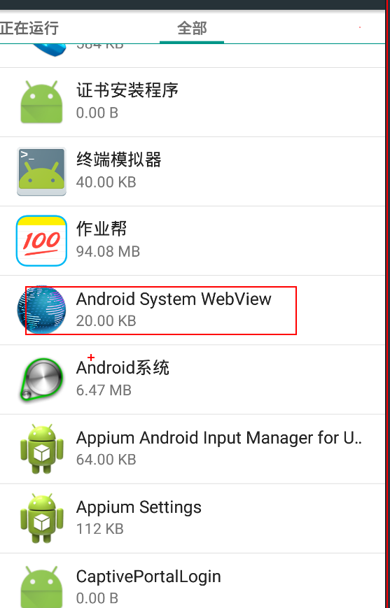

  2、在手机或者模拟器上面安装chrome浏览器(手机或者模拟器中chrome版本要低于电脑上chrome的版本)

  3、设置PC电脑上面的appium中chromedriver的版本，chrome版本要与webView的版本配套。

  替找appium中的chrome版本：

  C:\Users\LiaoFei\node_modules\appium\node_modules\appium-chromedriver\chromedriver\win


* 查看H5页面的元素信息

  1、在手机或者模拟器当中打开H5的页面

  2、在PC的chrome浏览器当中，打开对应的地址： [chrome://inspect/#devices](chrome://inspect/#devices) 

  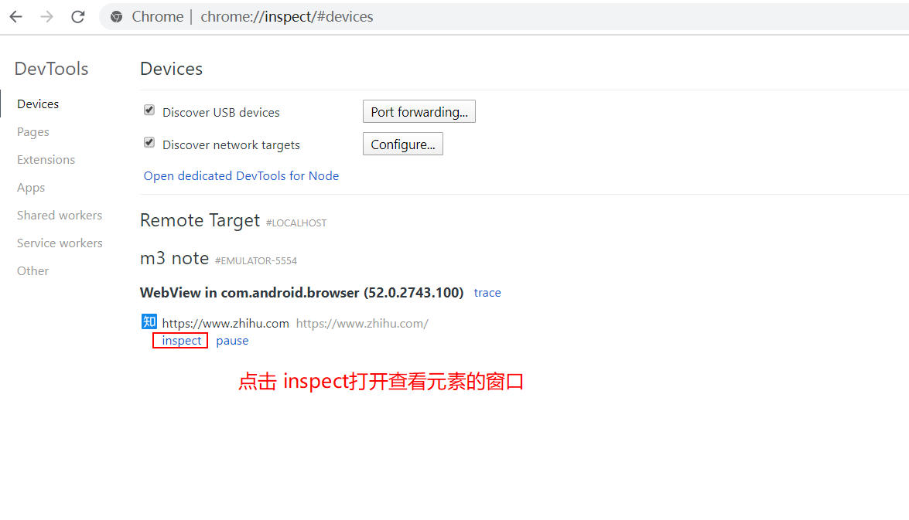

3、通过devtools来查看对应的元素信息。

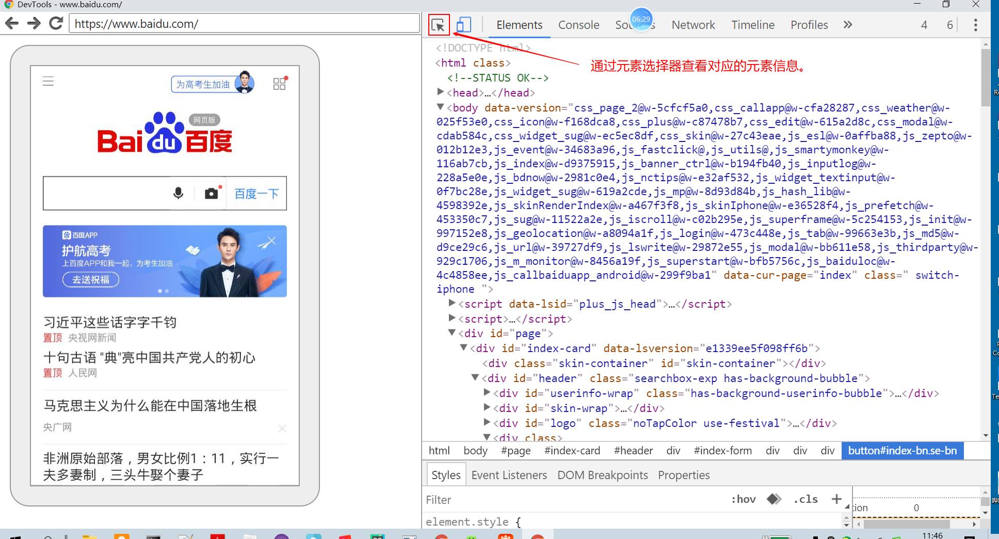


代码实现步骤：

1、首先要获取context的信息， 如果是原生的app，context的信息显示为Native App,  如果页面为webView的页面，context的信息显示为webView的名称。如果需要在app当中查看对应的webView的名，需要在app的代码当中加上以下的代码：

```
if (Build.VERSION.SDK_INT>=Build.VERSION_CODES.KITKAT) {
    WebView.setWebContentsDebuggingEnabled(true);
}
```


2、切换到web页面

driver.switch_to.context(context)

```python
import time

from appium import webdriver
from appium.webdriver.common.touch_action import TouchAction
from selenium.webdriver.common.by import By

from utils import get_element, input_text, execute_swipe, element_is_exsit, get_toast

des_cap = {
"platformName" : "android" ,   #表示的是android  或者ios
"platformVersion" : "5.1.1",   #表示的是平台系统的版本号
"deviceName" : "****",    #表示的是设备的ID名称（如果只有一个设备可以用****来代替）
"appPackage" : "com.android.browser",   #表示app的包名
"appActivity" :  ".BrowserActivity",      #表示的是app的界面名
"resetKeyboard": True,        # 重置设备的输入键盘
"unicodeKeyboard": True,        # 采用unicode编码输入
"noReset": True,
"automationName": 'Uiautomator2',
"chromedriverExecutableDir": r"D:\BaiduNetdiskDownload\apptools\apk\chromedriver_win32_2.22"  # 用来指定chrome驱动的目录
####"".module_main.activity.MainActivity""
}  #定义字典参数

driver = webdriver.Remote("http://localhost:4723/wd/hub", des_cap)

print(driver.contexts)
driver.get("http://m.baidu.com")
time.sleep(2)
driver.switch_to.context("WEBVIEW_com.android.browser")

driver.find_element(By.ID, "index-kw").send_keys("python")
time.sleep(3)
driver.find_element(By.ID, "index-bn").click()
time.sleep(5)
driver.quit()

```


